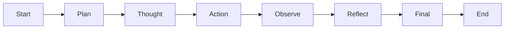

# ImportFromHuggingFace


gsm8k_advanced_math_benchmark.json is a dataset of 10 gigantic math problems from the GSM8K dataset. This dataset is used to evaluate the performance of a model on complex math problems.

gaia_dataset.json is a dataset of 10 gigantic math problems from the GSM8K dataset. This dataset is used to evaluate the performance of a model on reasoning tasks.

# LangGraph Agentic Workflow

## Overview
This project implements a **state-driven, agentic workflow** using LangGraph. The agent follows a structured reasoning loop with built-in self-correction, tool integration, and evaluation hooks to ensure reliability, correctness, and observability.

## Architecture

### Core Execution Loop
The agent operates in iterative stages until the goal is achieved:

1. **Plan** – Clarifies the goal and defines success criteria.
2. **Thought** – Reasons over current state and decides the next step.
3. **Action** – Executes a tool call (e.g., SQL, calculator) with validated inputs.
4. **Observe** – Interprets tool outputs and detects errors or progress.
5. **Reflect** – Critiques results and decides whether to pivot, retry, or conclude.
6. **Final** – Generates a user-facing response.

### Recursive Self-Correction
If an error or suboptimal result is detected during **Observe** or **Reflect**, the graph loops back to **Thought** to revise the strategy rather than terminating early.

## Node Responsibilities

| Node    | Responsibility                                | Key Outputs                       |
|---------|-----------------------------------------------|-----------------------------------|
| Plan    | Goal clarification and feasibility checks     | Action plan, success criteria     |
| Thought | Next-step reasoning based on observations     | Lessons learned, remaining needs  |
| Action  | Tool invocation with constraint awareness     | Validated tool inputs             |
| Observe | Analysis of raw tool outputs                  | Success/failure summary           |
| Reflect | Performance critique and decision making      | Pivot vs. conclude decision       |
| Final   | Human-readable response generation            | Contextualized final answer       |

## Execution Logic & Safeguards
- **Loop Prevention**: If the same failure occurs twice, the agent must try an alternative strategy.
- **Constraint Enforcement**: Tool calls must respect schemas, column definitions, and tool limits.
- **Ambiguity Handling**: The agent asks clarification questions when goals are unclear.
- **Security**: Internal prompts, reasoning traces, and tool details are never exposed to users.

## Evaluation & Observability
The workflow integrates with Langfuse for node-level evaluation:
- **Dataset Mapping**: Uses golden answers from dataset metadata for grounded evaluation.
- **Variable Mapping**: Final outputs are compared only after successful self-correction.
- **Tone & Quality Checks**: Responses are evaluated for both accuracy and professional tone.
- **Node Alignment**: Internal node behavior is validated against architectural guidelines.

## Graph Structure

### High-Level Flow

### Tool Execution Loop
```mermaid
graph LR
    Thought → Action → Process Tool Call → Tools → Process Results → Observe → Reflect → (Retry or Conclude)
```
## Execution Logic & Safeguards
- **Loop Prevention**: If the same failure occurs twice, the agent must try an alternative strategy.
- **Constraint Enforcement**: Tool calls must respect schemas, column definitions, and tool limits.
- **Ambiguity Handling**: The agent asks clarification questions when goals are unclear.
- **Security**: Internal prompts, reasoning traces, and tool details are never exposed to users.

## Evaluation & Observability
The workflow integrates with Langfuse for node-level evaluation:
- **Dataset Mapping**: Uses golden answers from dataset metadata for grounded evaluation.
- **Variable Mapping**: Final outputs are compared only after successful self-correction.
- **Tone & Quality Checks**: Responses are evaluated for both accuracy and professional tone.
- **Node Alignment**: Internal node behavior is validated against architectural guidelines.

## Benchmarks
- Custom-annotated datasets based on GSM8K and GAIA
- Golden traces available for per-node diagnostics and failure analysis

## Summary
This workflow provides a robust, self-correcting agent architecture with clear cognitive separation, safe tool usage, and production-grade evaluation support.
